ALGORITMOS Y ESTRUCTURAS DE DATOS

**Guía 9. Proyecto LCD – Fases I y II**

**Introducción**

El presente trabajo práctico le propone al alumno trabajar con un
display de cuarzo líquido (LCD) alfanumérico de 2x16 caracteres.

El alumno deberá programar una librería que permita manejar el LCD y
contenga el driver del LCD al igual que una capa de abstracción
(conocida en inglés como HAL por sus siglas Hardware Abstraction Layer)
que le permitirán a quien la utilice manipular el display.

Los objetivos de este proyecto son:

1.  Modelado y simulación de hardware. En este proyecto se modelará y
    simulará un display de cuarzo líquido (LCD) conectado por USB a
    una PC.

2.  Interacción con el dispositivo físico a bajo nivel

3.  Introducción del concepto de driver

4.  Introducción del concepto de capas de abstracción

Los conocimientos necesarios para poder realizar el proyecto son:

1.  Estructura y programación de un display de cuarzo liquido tipo
    Hitachi HD44780.

2.  Estructura y programación de un adaptador USB a un puerto
    digital (FTDI).

3.  Nociones elementales sobre drivers virtuales.

4.  C++, clases, objetos, encapsulamiento y polimorfismo.

A continuación se hará un breve resumen de cada uno de los ítems 5 y 6
para que el alumno pueda desarrollar el proyecto. Si se desea ampliar o
profundizar algún aspecto se puede recurrir a la Web donde se puede
encontrar abundante literatura (ver al final algunos links).

El módulo de display se puede retirar del pañol de electrónica bajo el
código PLFTDILCD y **se deberá devolver ANTES de rendir el segundo parcial, su devolución
es de carácter** **obligatorio y condición necesaria para poder rendir
el segundo parcial**.

Las instrucciones para la instalación del driver se pueden descargar de
*http://www.ftdichip.com/Drivers/D2XX.htm*.

**Displays de cuarzo líquido (LCD)**

Los displays de cuarzo líquido son usados en innumerables aplicaciones.

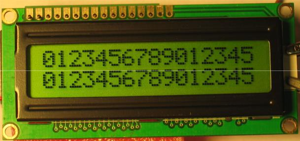

Básicamente existen dos grandes grupos:

-   Alfanuméricos

-   Gráficos

Los alfanuméricos se usan exclusivamente para mostrar texto mientras que
los gráficos también pueden mostrar imágenes.

En este proyecto se usará un display alfanumérico de 2 líneas de 16
caracteres cada una. Cada carácter está representado como una matriz de
5 x 8 pixeles. La última línea es usada únicamente para el cursor:

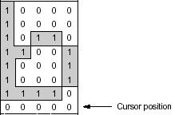

**Displays tipo HD44780**

**Comunicación con el display**

El display se puede acceder a través de dos registros, ambos visibles
desde el exterior con un bus de datos de 8 bits:

-   El IR (Instruction Register) permite enviar instrucciones
    > al display. Por ejemplo, una instrucción es “borrar display”.

-   El DR (Data Register) permite enviar los caracteres que se
    > desean mostrar.

La línea de control RS (Register Select) nos permite definir a cuál de
los dos registros (IR o DR) queremos acceder. Por ejemplo, para
comunicarnos con el IR debemos poner RS en 0 y luego podremos acceder al
registro de instrucciones. De la misma forma podremos acceder a DR
poniendo RS en 1.

El display también tiene una línea de control llamara R/W (Read/Write)
que indica si estamos leyendo o escribiendo datos en el display. En el
caso particular del módulo de LCD de este proyecto R/W es siempre 0, por
lo tanto sólo podremos escribir.

La última línea de control es E (Enable). Esta línea es análoga a la
tecla ENTER de un teclado, y es la que indica al display que los valores
de las otras líneas son válidos. Antes de comunicarnos debemos
asegurarnos de que el valor de E es 0. Cuando ponemos E en 1, el comando
o dato será aceptado por el display. Dependiendo del caso, las líneas se
deben mantener por cierto tiempo.

El esquema de conexiones del display:

|      |     |     |          |     |                         |     |
|------|-----|-----|----------|-----|-------------------------|-----|
| RS   |     |     |          |     |                         |     |
| R/W  |     |     | RS=0     |     |
|      |     |     |          |     |                         |     |
| E    |     |     | **IR**   |     | **RECURSOS INTERNOS**   |     |
|      |     |     |          |     |                         |     |
| D0-7 |     |     |          |     |                         |     |
|      |     |     |          |     |                         |     |
|      |     |     |          |     |                         |     |
|      | 8   |     |          |     |                         |     |
|      |     |     | **DR**   |     |                         |     |
|      |     |     |          |     |                         |     |
|      |     |     |          |     |                         |     |
|      |     |     |          |     |                         |     |
|      |     |     | RS=1     |     |                         |
|      |     |     |          |     |                         |     |

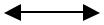

Por lo tanto debemos seguir los siguientes pasos para hacer una
escritura en el display:

1.  Asegurarnos de que E vale 0

2.  Configurar RS en función del registro que queramos acceder. El valor
    0 para el IR o el valor 1 para el DR

3.  Poner el dato o comando en el bus de datos

4.  Poner E en 1, esperar el tiempo que el comando requiera, y luego
    poner E en 0

**Instrucciones**

A continuación se detallan las instrucciones que el display acepta:

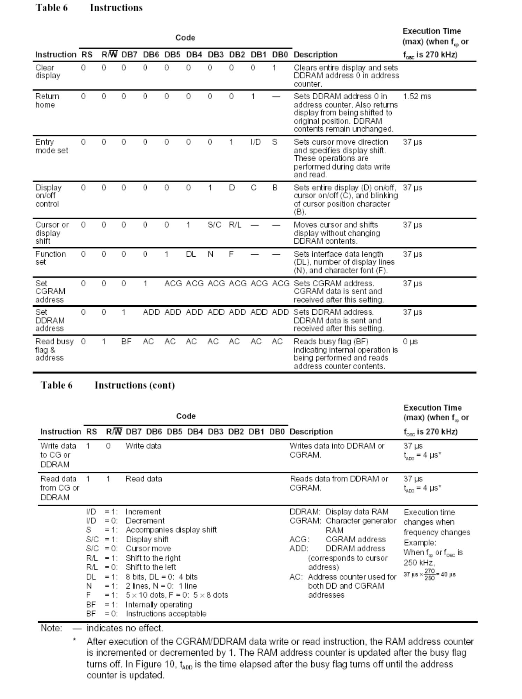

Veamos un ejemplo de cómo ejecutar la instrucción “Clear display”.
Primero vamos a la tabla anterior y buscamos el código de esa
instrucción:

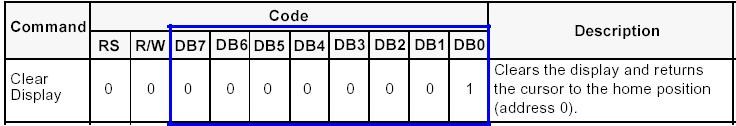

Luego seguimos esta secuencia:

1.  Se debe asegurar de que E está en 0

2.  Poner RS en 0 (para indicar el acceso al IR)

3.  Escribir 0x01 en el bus de datos

4.  Poner E en 1, esperar un tiempo, y poner E en 0

**Memoria del display CGROM (Character Generator ROM)**

La memoria CGROM es una memoria ROM que contiene las fuentes de los
caracteres que el display puede mostrar.

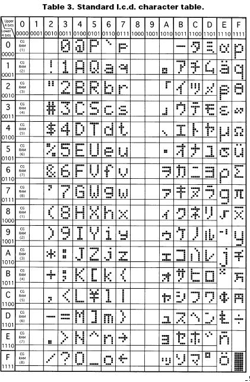

**Memoria del display DDRAM (Display Data RAM)**

Esta memoria es RAM y almacena los caracteres que el display muestra. Es
de 80 bytes, y su organización es la siguiente:

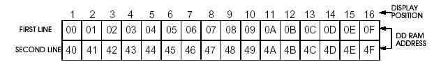

Cada fila y columna del display tiene asociada una dirección de memoria
de la DDRAM. Para ambas líneas estas direcciones son consecutivas
(0x00-0x0f, y 0x40-0x4f), pero entre las líneas hay un gap.

Como ya vimos, podemos escribir caracteres al display escribiendo en su
DR. Para determinar la dirección de escritura (posición en el display)
se usa un registro interno llamado AC (Address Counter).

Este registro puede verse como un puntero que apunta a la próxima
dirección a escribir. Se autoincrementa después de cada escritura, y el
cursor (si está habilitado) avanza a la próxima posición.

En muchos casos puede ser deseable (y recomendable) controlar el AC
manualmente, para lo cual podemos enviar la siguiente instrucción:

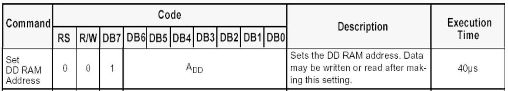

ADD es la dirección que quedará guardada en el AC.

El display se encarga de refrescar el LCD, leyendo los caracteres
continuamente de la DDRAM, y dependiendo de estos caracteres, mostrando
los pixeles que están grabados en la CGROM.

**Memoria del display CGRAM (Character Generator RAM)**

El display también permite caracteres definidos por el usuario. Para
poder hacerlo, se deberá definir el patrón de bits de los pixeles fila
por fila. El número máximo de caracteres definidos por el usuario es 8.
Los detalles pueden verse en la siguiente tabla:

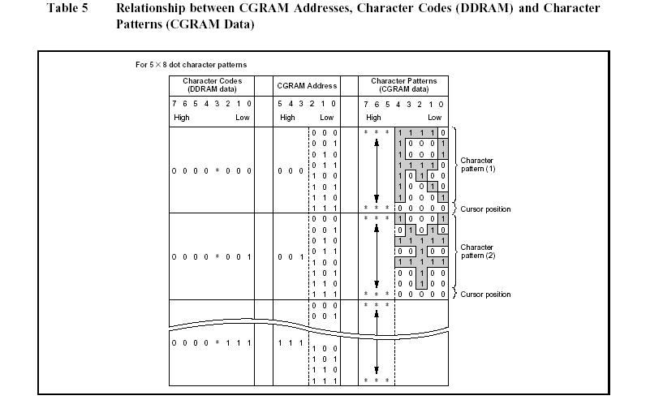

**Modo de datos**

Los displays tipo HD44780 pueden recibir datos en dos modos: 4 bits y 8
bits. Para poder configurar el modo del display se debe enviar la
instrucción “Function set”:

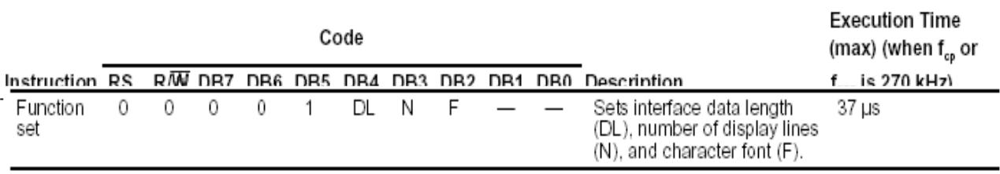

-   El bit DL controla el modo de datos (1 para 8 bits, 0 para 4 bits).

-   En el modo de 8 bits, los datos se envían directamente como
    ya vimos.

-   En el modo de 4 bits, sólo se usan 4 líneas (D4-D7). Las líneas
    D0-D3 están deshabilitadas. Para enviar un byte es necesario
    separarlo en 2 nibbles. El nibble alto (bit 7-bit 4) se envía
    primero, y luego se continúa con el nibble bajo (bit 3-bit 0).

**Inicialización**

Cuando comenzamos a usar el display debemos asegurarnos de que esté
inicializado.

Para inicializar en el modo de 4 bits debemos seguir esta secuencia:

1.  Enviar el nibble alto de “function set” con el modo en 8 bits

2.  Esperar 4 ms

3.  Enviar el nibble alto de “function set” con el modo en 8 bits

4.  Esperar 100 µs

5.  Enviar el nibble alto de “function set” con el modo en 8 bits

6. Enviar el nibble alto de “function set” con el modo en 4 bits. (a
   partir de ahora enviamos las instrucciones separadas en dos nibbles)

7.  Enviar la instrucción “function set” con el modo en 4 bits, 2 líneas
    y fuente de 5x8

8.  Enviar la instrucción “display on/off control” con todo apagado

9.  Enviar la instrucción “clear screen”

10.  Enviar la instrucción “entry mode set”

Para referencias del fabricante, ver la hoja de datos (Figura 24).

**Módulo LCD-FTDI**

Para comunicar el display tipo HD44780 a la PC usaremos un adaptador USB
a puerto paralelo:

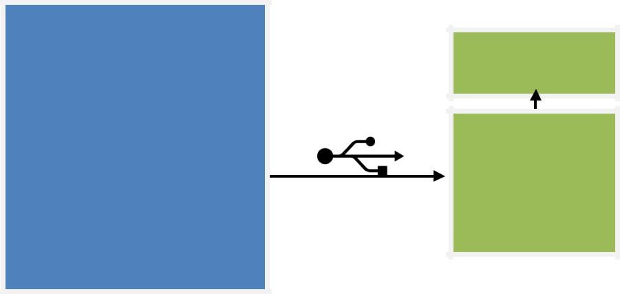

Dicho adaptador (FTDI) ofrece un puerto paralelo de 8 bits que está
conectado al display de acuerdo al siguiente esquema:

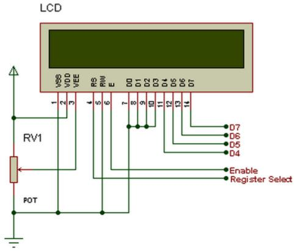

A continuación se muestran las conexiones entre el puerto paralelo y el
display:

|                   |                   |
|-------------------|-------------------|
| Puerto paralelo   | Display           |
| Bit 0 (LSB)       | Enable            |
| Bit 1             | Register Select   |
| Bit 2             | No conectado      |
| Bit 3             | No conectado      |
| Bit 4             | D4                |
| Bit 5             | D5                |
| Bit 6             | D6                |
| Bit 7 (MSB)       | D7                |
|                   |                   |

Es importante notar que el LSB es el bit menos significativo (por sus
siglas en inglés “Least Significant Bit) y el MSB es el bit más
significativo (Most Significant Bit), por lo tanto, el valor 0x01 prende
el E y apaga a todos los demás. El valor 0x02 prende el RS y paga todo
los demás. El valor 0x10 prende D4 y apaga todos los demás y así
sucesivamente.

Debemos usar el modo de 4 bits del display, dado que las líneas D0-D3 no
están conectadas.

**Acceso al puerto paralelo**

Para poder acceder al puerto paralelo debemos instalar un driver que se
puede descargar desde esta URL
*http://www.ftdichip.com/Drivers/D2XX.htm*. El mismo es multiplataforma
y el detalle de como instalarlo se encuentra en la D2XX Programmer’s
Guide en el siguiente link:
*http://www.ftdichip.com/Support/Documents/ProgramGuides/D2XX\_Programmer's\_Guide(
FT\_000071).pdf*.

 **Programación del puerto**

Hay una serie de precauciones a tener en cuenta cuando se manejan
puertos: cuando queremos cambiar un bit de un puerto debemos
asegurarnos de no alterar los demás bits. Esto se debe hacer usando
máscaras que nos permitan proteger aquellos bits que no deseamos
afectar.

La estrategia cambia según la naturaleza del puerto. Si el puerto es
sólo de salida (no hay feedback) sólo nos queda guardar una copia de
lo último que escribimos al puerto en una variable. Si ahora queremos
alterar un bit del puerto primero modificamos ese bit en la variable y
luego la escribimos al puerto. En el caso que el puerto tenga feedback
usamos dicho puerto como variable.
Mediante el uso de máscaras, funciones OR, AND y NOT podemos aislar y
modificar un solo bit en un puerto (ver apunte de compiladores de
Introcom).

Aprender a definir máscaras es importante para el manejo de puertos.

Los pasos para definir los bits de un puerto son:

1.  Asignación de nombres a las posiciones físicas de los bits

Ej.: si tenemos el registro de salida del puerto entonces las
     asignaciones serían en lenguaje ensamblador así:

|                      |       |     |
|----------------------|-------|-----|
| PORT\_P0             | equ   | 0   |
| PORT\_P1             | equ   | 1   |
| En lenguaje C sería: |       |     |
| \#define PORT\_P0    |       | 0   |
| \#define PORT\_P1    |       | 1   |

Lo importante es que tengamos nombres simbólicos para cada bit y ¡no
números mágicos!

2. En el paso previo le dimos nombres simbólicos a elementos físicos
ahora debemos hacer una asignación lógica o funcional de cada bit
físico (es decir que vinculo existe entre la función lógica y el
elemento físico. Por ejemplo:

> \#define LCD\_RS (1 &lt;&lt; PORT\_P1) //LCD RS

Mediante esta expresión asignamos el bit 1 (PORT\_P1) de nuestro
puerto de control al símbolo LCD\_RS. Este paso es de suma importancia
pues si en algún momento decidimos que la alimentación del display va
a ser controlada por otro bit solo tenemos que realizar el cambio en
la línea previa sin afectar el resto del programa. Nótese que la
expresión 1&lt;&lt; (PORT\_P1) posiciona al 1 en el lugar
correspondiente al segundo bit (1) del byte que forma al puerto
paralelo es decir:

> LCD\_RS = 0000 0010

3. Definición de máscaras. Las máscaras sirven para aislar ciertos
bits que forman el byte. Para la definición de las mismas deben
intervenir todos los bits del puerto que tengan un propósito o
función. Ej.: Si LEDROJO y LEDVERDE son los únicos bits del byte que
forma al puerto entonces la máscara seria:

|                    |              |                            |
|--------------------|--------------|----------------------------|
| \#define LED\_ROJO | (1           | &lt;&lt; PORT\_P0)         |
| \#define           | LED\_VERDE   | (1                         |
| \#define           | MASK\_LEDS   | (LED\_ROJO | LED\_VERDE)   |

También puede resultar conveniente generar la máscara complementaria
para poder quedarse con el resto de los bits del puerto:

> \#define NOT\_MASK\_LEDS ~(MASK\_LEDS)

|                           |             |
|---------------------------|-------------|
| Como resultado tendremos: |             |
| MASK\_LEDS                | = 1000 0001 |
| NOT\_MASK\_LEDS           | = 0111 1110 |

Entonces mediante el operador AND podemos aislar los bits que
deseemos.

1.  Definición de niveles lógicos

En el punto 2 hicimos una asignación entre el nivel lógico y el nivel
físico. Es decir qué función lógica va a ser asignada a que recurso
físico. De esta manera nos independizamos de la ubicación del recurso
físico en el puerto (RS va a seguir siendo el control RS del display
independientemente de con que bit del puerto se realiza esta función).

Ahora nos queda por independizarnos de los niveles lógicos. Si por
ejemplo tenemos un LED conectado a un pin del puerto este LED puede
ser encendido cuando ponemos un 1 en este pin. Decimos entonces que el
control del LED es activo alto. Por el contrario si para encender el
mismo LED necesitamos poner un 0 (porque cambio algo en el hardware)
decimos que el control es activo bajo.

Cuando uno escribe las rutinas que manejan dispositivos físicos no se
puede estar pensando si el dispositivo que se está controlando es o no
activo alto uno se debe independizar de esto de lo contrario se pueden
incurrir en infinidad de errores. La mejor manera de hacer esto es
definiendo los niveles lógicos una sola vez y en un solo lugar de
nuestro programa.

Ejemplo: si la línea RS es activo-alta podemos definir las funciones
de la siguiente manera:

> // Hardware not inverted (active high)

|          |                |                       |
|----------|----------------|-----------------------|
| \#define | LCD\_RS\_ON    | (LCD\_RS)             |
| \#define | LCD\_RS\_OFF   | (LCD\_RS ^ LCD\_RS)   |

Nótese la notación usada: para la función que es activo alta usamos la
definición lógica mientras que para la que es activo baja usamos la
XOR de la definición lógica consigo misma (lo que da 0 por supuesto).
Esto es lo que llamo comentario implícito pues enfatiza el hecho que
LCD\_RS\_OFF es activo bajo.

Supongamos ahora que hay un bit LCD\_TEST que es activo bajo. Entonces
haríamos:

>// Hardware inverted \#define LCD\_TEST\_ON \#define LCD\_TEST\_OFF
>
>(active low) (LCD\_TEST ^ LCD\_TEST) (LCD\_TEST)

Con estas simples reglas nuestro código se independiza del hardware y
¡desaparecen los famosos números mágicos!

**Niveles o capas de abstracción**

Cuando se programa hardware siempre se debe incrementar el nivel de
abstracción desde los niveles más bajos hasta los más altos. Los niveles
más bajos son también conocidos como funciones o rutinas de bajo nivel o
drivers. Estas funciones entran en contacto con el hardware en forma
directa y serán invocadas por funciones de mayor abstracción que forman
una capa por encima de ellas. Así se puede continuar hasta llegar a la
capa más alta del sistema (usualmente la que está en contacto con el
usuario)

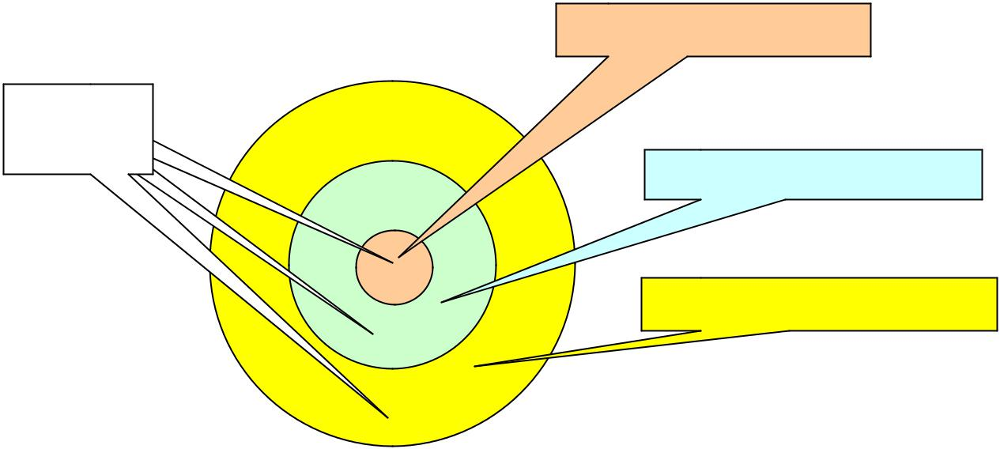

El número de capas dependerá del problema en particular. Que es lo que
separa una capa de la otra está dado por el nivel de abstracción. Este
nivel de abstracción esta en directa relación con los datos que maneja
cada capa. Cada capa maneja un “lenguaje” (abstracciones) y se debe
evitar que haya solapamiento cuando se definen estas capas.

Lo que siempre se trata de hacer es crear una capa alrededor de los
drivers de manera de independizarse del mismo esto es lo que se conoce
como Hardware Abstraction Layer o HAL. De esta manera diferentes
aplicaciones pueden usar un hardware sin que realmente sepan como es.

Cuando instalamos un modem o una impresora lo único que cambia es el
driver.

 **Proyecto Fase I**

1.  Aplicando lo explicado, escribir la definición de los siguientes
    ítems:

    1.  Asignación de nombres a los pines del puerto

    2.  Asignación de las siguientes funciones a los pines del puerto de
        control

|         |           |              |
|---------|-----------|--------------|
| LCD\_E  | //Linea   | E del LCD    |
| LCD\_RS | //Linea   | RS del LCD   |
| //etc.  |           |              |

1.  Máscaras.

2.  Funciones de cada línea e indicar su polaridad. Por ejemplo,
    > LCD\_E\_ON, LCD\_E\_OFF

<!-- -->

1.  Definir todas las instrucciones del LCD. Por ejemplo, \#define
    LCD\_CLEAR 0x01

2.  Escribir las siguientes funciones de bajo nivel:

> //Inicializa el FTDI y el LCD
>
> FT\_HANDLE \* deviceHandler lcdInit(int iDevice); //Escribe un byte al
> IR
>
> void lcdWriteIR(FT\_HANDLE \* deviceHandler, BYTE valor); //Escribe un
> byte al DR
>
> void lcdWriteDR(FT\_HANDLE \* deviceHandler, BYTE valor);

Nótese que estas funciones representan la capa baja pues el código que
contienen tiene acceso directo al puerto. Para simplificar el código
de las mismas se deben escribir las siguientes funciones:

> lcdWriteNibble(FT\_HANDLE \* deviceHandler, BYTE value);
> lcdWriteByte(FT\_HANDLE \* deviceHandler, BYTE value, BYTE rs);
>
La primera función escribe directamente un nibble al display. Por
ejemplo:

> lcdWriteNibble(deviceHandler, LCD\_RS | LCD\_D6);

Mientras que la segunda escribe el byte recibido al display. Si
utilizamos el modo 4 bits deberemos realizar dos llamadas a
> lcdWrietNibble(); por lo que la primera función será invocada dos
> veces por la segunda.

Una alternativa podría ser definir estas funciones:

> lcdSetBit(BYTE port, BYTE value) lcdClearBit(BYTE port, BYTE value)

En este caso value debe tener en 1 aquellos bits que queremos
modificar.

La ventaja de estas funciones es que no nos tenemos que preocupar por
los demás bits del puerto pues quedan intactos. La desventaja es que
debemos recordar en qué estado están los demás bits dado que la
modificación de los mismos puede estar en diferentes partes de nuestro
código.

Desde el punto de vista de documentación la forma anterior es mejor
(escribir el valor del puerto directamente) pues estamos obligados a
especificar todos los bits en una línea de código evitando así tener que
mirar líneas de código previas para saber si ya fue o no modificado un
determinado bit.

Otra desventaja de setBit/clearBit es que el módulo debe recordar el
estado de los niveles anteriores.

Finalmente otra desventaja muy crítica en ciertos casos es que no
podemos cambiar dos bits en forma simultánea si sus niveles son
opuestos. Es por eso que no es una buena idea usar funciones que
modifiquen bits en forma individual.

 **Proyecto Fase II**

En esta etapa montaremos una capa sobre la anterior que nos permita
una mejor comunicación con las capas superiores. Utilizaremos C++; por
lo tanto, el objetivo de esta fase es desarrollar e implementar una
clase que nos permita manipular el LCD.

Abajo se incluye el prototipo de una clase abstracta a implementar
junto con una descripción de cada una de las funciones que la
componen.

Deberán implementar la clase basicLCD como una clase abstracta (todas
sus funciones miembro públicas virtuales e igualadas a 0, a excepción
del constructor) respetando absolutamente el prototipo de abajo. No
está permitido incluir nuevas funciones miembro públicas a la clase ni
eliminar funciones o variables miembros del prototipo especificado
abajo. Además deberán crear una clase concreta a partir de basicLCD
que contenga todas las implementaciones de las funciones descriptas en
basicLCD para el caso particular del display Hitachi HD44780.

Podrán agregar funciones y variables miembros private para
“customizar” la clase. Más adelante vamos a ver una forma más
eficiente de customizar clases sin necesitada de cambiar el template.

Se deberá realizar también un programa de prueba (main) que permita
probar una instancia (objeto) de la clase que ustedes armen heredada
de basicLCD.

 **Prototipos**

> struct cursorPosition
>
> {
>
> int row; int column;
>
> };
>
> class basicLCD
>
> {
>
> public:
>
> /\*=====================================================

-   Name: basicLCD

-   Entra: -

-   Resulta: Constructor de la clase. Inicializa el LCD y deja

-   todo listo comenzar a utilizarlo.

> \*
>
> \* cadd =1 (cursor address) (ver NOTA 1)
> \*=====================================================\*/
>
> basicLCD();
>
> /\*=====================================================

-   Name: ~basicLCD

-   Entra: -

-   Resulta: Destructor de la clase. Libera cualquier recurso

-   que se hubiera tomado de forma de evitar

-   "resources leak".
    \*=====================================================\*/

> ~basicLCD();

> /\*=====================================================

-   Name: lcdInitOk

-   Entra: -

-   Resulta: No genera ningún cambio en el display.

-   Devuelve en su nombre “true” si el display se inicializó

-   correctamente (el constructor no tuvo errores) o “false

-   en caso contrario.
    \*=====================================================\*/ virtual
    bool lcdInitOk() = 0;

> /\*=====================================================

-   Name: lcdGetError

-   Entra: -

-   Resulta: No genera ningún cambio en el display.

-   Devuelve en su nombre FT\_OK si no existe ningún error.

-   Caso contrario devuelve en su nombre el error que se

-   haya producido trabajando con la librería ftd2xx
    \*=====================================================\*/ virtual
    FT\_STATUS lcdGetError() = 0;

> /\*=====================================================

-   Name: lcdClear

-   Entra: -

-   Resulta: Borra el display y el cursor va a HOME

-   cadd =1

-   Devuelve en su nombre “true” si fue satisfactoria “false”

-   en caso contrario.
    \*=====================================================\*/ virtual
    bool lcdClear() = 0;

> /\*=====================================================

-   Name: lcdClearToEOL

-   Entra: -

-   Resulta: Borra el display desde la posición actual

-   del cursor hasta el final de la línea.

-   cadd = No se altera

-   Devuelve en su nombre “true” si fue satisfactoria “false”

-   en caso contrario.
    \*=====================================================\*/ virtual
    bool lcdClearToEOL()= 0;

> /\*=====================================================

-   Name: operator&lt;&lt;()

-   Entra: Un carácter

-   Resulta: Pone el carácter en la posición actual

-   del cursor del display y avanza el cursor a la próxima

-   posición respetando el gap (si el carácter no es imprimible

-   lo ignora)

-   Modifica: (cadd)

-   Devuelve en su nombre una referencia a un basicLCD que permite

-   encascar la función:

-   basicLCD lcd;

-   lcd &lt;&lt; ‘a’ &lt;&lt; ‘b’ &lt;&lt; ‘c’;
    \*=====================================================\*/ virtual
    basicLCD& operator&lt;&lt;(const unsigned char c) = 0;

> /\*=====================================================

-   Name: operator&lt;&lt;()

-   Entra: Una cadena de caracteres NULL terminated

-   Resulta: imprime la cadena de caracteres en la posición actual

-   del cursor y avanza el cursor al final de la cadena respetando

-   el gap (si algún carácter no es imprimible lo ignora). Si recibe una

-   cadena de más de 32 caracteres, muestra los últimos 32 en
    el display.

-   Modifica: (cadd)

-   Devuelve en su nombre una referencia a un basicLCD que permite

-   encascar la función:

-   basicLCD lcd;

-   lcd &lt;&lt; “Hola” &lt;&lt; “ “ &lt;&lt; “Mundo”;
    \*=====================================================\*/ virtual
    basicLCD& operator&lt;&lt;(const unsigned char \* c) = 0;

> /\*=====================================================

-   Name: lcdMoveCursorUp

-   -   Entra: -

-   Resulta: Pasa el cursor a la primera línea del display sin

-   alterar la columna en la que estaba.

-   Modifica: (cadd)

-   Devuelve en su nombre “true” si fue satisfactoria “false”

-   en caso contrario.
    \*=====================================================\*/ virtual
    bool lcdMoveCursorUp() = 0;

> /\*=====================================================

-   Name: lcdMoveCursorDown

-   -   Entra: -

-   Resulta: Pasa el cursor a la segunda línea del display sin

-   alterar la columna en la que estaba.

-   Modifica: (cadd).

-   Devuelve en su nombre “true” si fue satisfactoria “false”

-   en caso contrario.
    \*=====================================================\*/ virtual
    bool lcdMoveCursorDown() = 0;

> /\*=====================================================

-   Name: lcdMoveCursorRight

-   -   Entra: -

-   Resulta: Avanza el cursor una posición

-   Modifica: (cadd).

-   Devuelve en su nombre “true” si fue satisfactoria “false”

-   en caso contrario.
    \*=====================================================\*/ virutal
    bool lcdMoveCursorRight() = 0;

> /\*=====================================================

-   Name: lcdMoveCursorLeft

-   -   Entra: -

-   Resulta: Retrocede el cursor una posición

-   Modifica: (cadd).

-   Devuelve en su nombre “true” si fue satisfactoria “false”

-   en caso contrario.
    \*=====================================================\*/ virtual
    bool lcdMoveCursorLeft() = 0;

> /\*=====================================================

-   Name: lcdSetCursorPosition

-   Entra: Recibe una estructura tipo cursorPosition

-   Resulta: Posiciona el cursor en la posición dada

-   por row y column. row\[0-1\] col\[0-19\]. Ante un valor inválido

-   de row y/o column ignora la instrucción (no hace nada).

-   Modifica: (cadd).

-   Devuelve en su nombre “true” si fue satisfactoria “false”

-   en caso contrario.
    \*=====================================================\*/

> virtual bool lcdSetCursorPosition(const cursorPosition pos) = 0;
>
> /\*=====================================================

-   Name: lcdGetCursorPosition

-   Entra: -

-   Resulta: Devuelve la posición actual del cursor.

<!-- -->

-   cadd = No se altera

-   -   Devuelve una estructura tipo cursorPosition
    \*=====================================================\*/ virtual
    cursorPosition lcdGetCursorPosition() = 0;

> protected:
>
> /\*=====================================================

-   Nota 1: cadd (cursor address) es una variable

-   que contiene la dirección actual del cursor en el

-   display+1. Esta variable es necesaria pues no podemos

-   leer el LCD para saber dónde está el cursor. Mediante

-   la funciones como lcdClear () o lcdSetCursorPosition()

-   podemos poner el cursor del display en una posición

-   conocida y por lo tanto sincronizarlo con cadd.

-   El constructor la inicializa y asegura su sincronismo.
    \*=====================================================\*/

> int cadd;
>
> /\*=====================================================

-   Name: lcdUpdateCursor ver NOTA 2

-   Entra: -

-   Resulta: Posiciona el cursor del display en la posición

-   dada por (cadd)-1. (cadd) = No se altera

> \*

-   El propósito de la función lcdUpdateCursor() es

-   informarle al display del valor de cadd cada vez que es

-   alterado. Esto es necesario pues si llamamos por ejemplo a

-   lcdMoveCursorUp() esta última calculará un nuevo valor

-   para cadd. Este nuevo valor de cadd deberá ser transferido

-   al cursor del display para poder sincronizar ambos.
    \*=====================================================\*/

> void lcdUpdateCursor();

**Bibliografía**

**C++**

1.  Effective C++ Third Edition 55 Specific Ways to Improve Your
    Programs and Designs. Scott Meyers. May 12, 2005.
    ISBN 0-321-33487-6.

2.  C++: The Complete Reference, 4th Edition. Herbert Schildt. Nov
    19, 2002. ISBN 0-072-22680-3.

3.  *www.cplusplus.com*

**FTDI**

1.  *http://www.ftdichip.com/Drivers/D2XX.htm*

2.  *http://www.codeproject.com/Articles/37982/Interact-with-FTDI-chip*

**HD44780 Datasheet**

> 1. *https://www.sparkfun.com/datasheets/LCD/HD44780.pdf*
